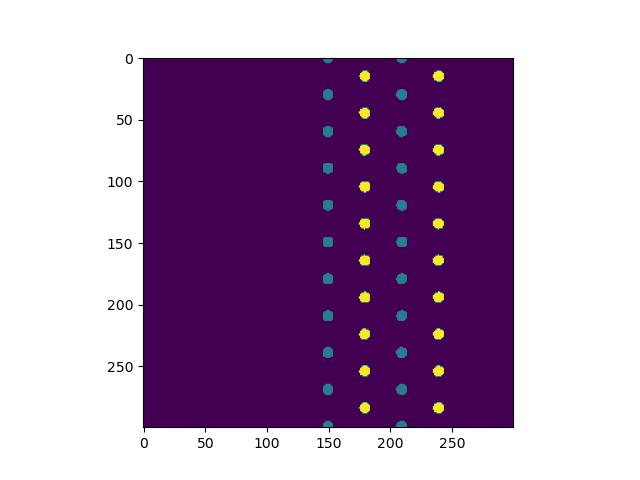

## Пример расчета  ##

Фотонный кристал.

Распределение поля Ez в этой области.

[Пример как это расчитать.](https://github.com/VladimirNikiforovv/computational-electrodynamics/blob/main/example.ipynb)

## Выводимые результаты  ##

фрактальное распределение диэлектрика в виде множества Мандельброта.

[Пример функции фрактальных распределений.](https://github.com/VladimirNikiforovv/fractal-programming/blob/main/Mandelbrot%20set.py)

Распределение поля Ez в этой области.

## Источники  ##

Allen Taflove  - computational electrodynamics
